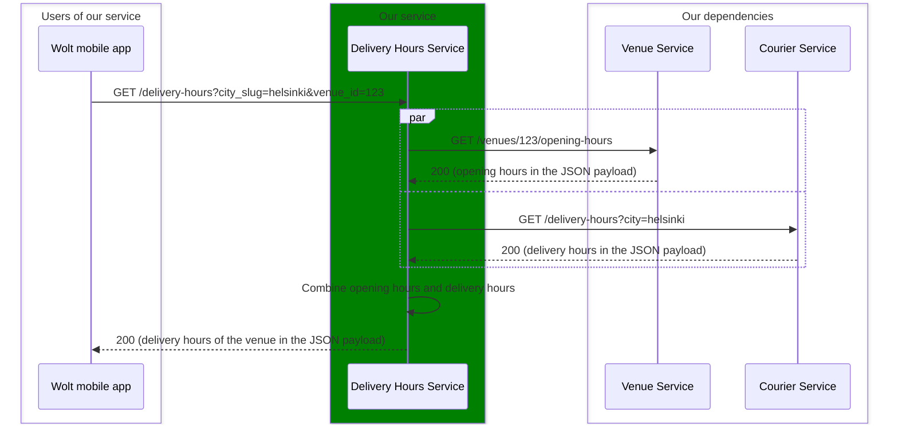

# System specification

## Overview


## Delivery Hours Service

This is the service you'll implement.
Delivery Hours Service has a single endpoint (_GET /delivery-hours_) which Wolt's consumer mobile clients use for getting information about delivery hours of a venue in a user interface friendly format.
The delivery hours of a venue are a combination of opening hours of a venue and the delivery hours of our courier fleet in the city of the venue.
Delivery Hours Service gets the opening hours of a venue from Venue Service and the delivery hours of the courier fleet from Courier Service.
Venue Service and Courier Service are provided as [WireMock](https://wiremock.org/) mocks in this assignment.

### _GET /delivery-hours_ specification
An endpoint for getting user interface friendly presentation of the delivery hours of a venue.

The delivery hours of a venue are basically an intersection of venue's opening hours and the delivery hours got from the Courier Service.

The only restriction is that the delivery hours of a venue should not be less than 30 minutes.
So, if there's an intersection which is less than 30 minutes, that should be excluded.

Some examples:

| Venue opening hours   | Delivery hours from Courier Service | Delivery hours of venue  |
|-----------------------|--------------------------------------|--------------------------|
| 13-20                 | 14-21                                | 14-20                    |
| 13:30-15, 16-01       | 09-14, 17-00:30                      | 13:30-14, 17-00:30       |
| 13-15                 | 09-13                                | Closed                   |
| 13-15                 | 14:31-16                             | Closed (less than 30 mins)|
| Anything              | Closed                               | Closed                   |
| Closed                | Anything                             | Closed                   |

#### Request
Query parameters:
* `city_slug` string (required): the name of the city 
* `venue_id` string (required): the ID of the venue whose delivery hours should be returned

Example request: _GET /delivery-hours?city_slug=helsinki&venue_id=123_

#### Response
The JSON response payload contains `"delivery_hours"` key which has the venue's delivery hours as an object in the value.
The delivery hours object contains a key for each weekday.
The value for each day is a string representing the delivery hours of that day.
The hours are presented in the `HH:MM` format with the `:MM` part omitted if case it would be `:00`. 
The hour values between 0-9 have a leading `0`, e.g. 9AM is `09`.
If there are multiple delivery hours for one day, they are separated with a comma followed by a space in the string presentation (`", "`).

Example response payload:
```json
{
   "delivery_hours": {
      "Monday": "09-12, 13:30-22",
      "Tuesday": "16:45-02",
      "Wednesday": "Closed",
      "Thursday": "Closed",
      "Friday": "Closed",
      "Saturday": "Closed",
      "Sunday": "Closed"
   }
}
```

## Venue Service & Courier Service

Venue Service and Courier Service are provided as [WireMock](https://wiremock.org/) mocks in this assignment.
Venue Service has an endpoint for getting opening hours of a venue based on venue ID (`GET /venues/<venue-id>/opening-hours`) and Courier Service has an endpoint for getting delivery hours of a city (`GET /delivery-hours?city=<city-slug>`).
Both endpoints have the same JSON response payload structure, and they both use 200 as HTTP status code for successful requests and 404 in case of unknown venue ID or city.

The JSON payload contains keys for each weekday which have opening / closing times.
The values for individual weekdays are a list of objects which have either `"open"` or `"close"` key with an opening/closing time as a value.
The value for `"open"`/`"close"` is a UNIX timestamp (1.1.1970 as a date).
The minimum value is 0 which means 00:00:00 and the maximum value is 86399 which means 23:59:59.
There can be multiple opening and closing occurrences during one day.
For each `"open"` there is a corresponding `"close"`.
The longest possible opening time (time between `"open"` and its corresponding `"close"`) is 24 hours.
Opening times don't overlap.
You can assume the response payload from Venue Service and Courier Service to follow this specification (i.e. to be valid).

Note that the closing might not be on the same day as the opening. For example, there could be an opening on Wednesday evening with the corresponding closing on early Thursday morning. See the full example below for more details.

Example response payload:
```json
{
  "monday": [
    {
      "open": 28800
    },
    {
      "close": 72000
    }
  ],
  "wednesday": [
    {
      "open": 72000
    }
  ],
  "thursday": [
    {
      "close": 3600
    },
    {
      "open": 28800
    },
    {
      "close": 52200
    },
    {
      "open": 57600
    },
    {
      "close": 72000
    }
  ]
}
```

In the example above:
* The opening (or delivery) hours would be Monday 8-20, Wednesday 20-01, and Thursday 8-14:30 & 16-20.
* Other days would be considered "closed".
